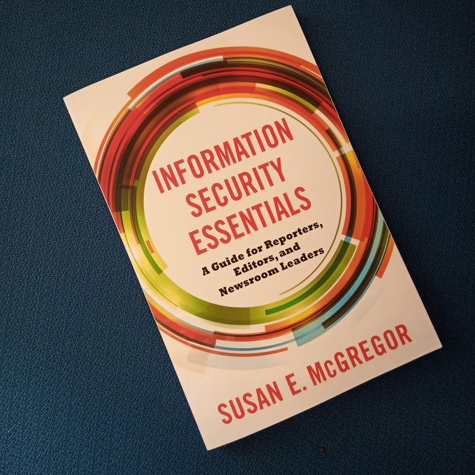
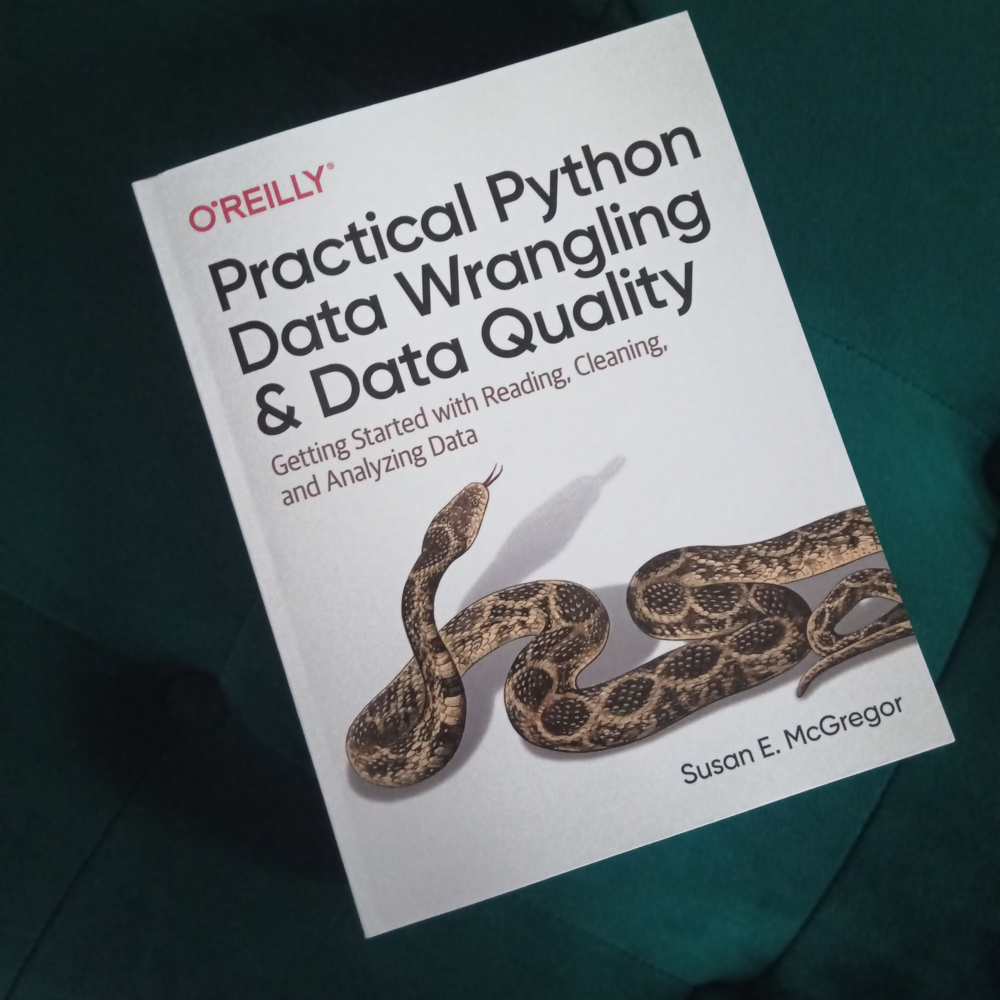

 

This book is the product of more than a decade working in and with news organizations and information security. Through countless conversations, workshops, interviews and experiments, this book is my effort to make essential information security expertise accessible to any newsroom or journalist. Though the legal context is US-centric, most of the principles and practices in this book - from compartmentalizing social media accounts to minimizing the data on your daily devices - is applicable to media professionals, academics and anyone who wants to understand and take better control of their digital information. Published by Columbia University Press in 2021, <em>Information Security Essentials</em> is available <a href="https://cup.columbia.edu/book/information-security-essentials/9780231192330" title="Link to book at Columbia University Press">directly from the publisher</a> and <a href="
https://bookshop.org/books/information-security-essentials-a-guide-for-reporters-editors-and-newsroom-leaders-9780231192330/9780231192330" title="Link to book at Bookshop.org">elsewhere</a> in <a href="https://www.amazon.com/Information-Security-Essentials-Reporters-Newsroom-ebook-dp-B08MWW2RJH/dp/B08MWW2RJH/ref=mt_other?_encoding=UTF8&me=&qid=" title="Link to Kindle edition">various formats</a>.

  

  
  -----

 

This book builds on more than a decade of working and teaching with data to generate original insights about the world. If you've never written Python–or any code, for that matter–this book will get you up and running in the first couple of chapters. If you've already dabbled a little bit with Python, you might prefer to start with Chapter 3, which outlines what to look for (or work towards) when it comes to data itself, while Chapter 4 includes full-functional code samples for loading and parsing almost every data format (even PDFs!) that you're likely to encounter. From there, you're ready to move on to APIs, an applied data-quality example, as well as tips and tricks for scaling and streamlining your code. The last few chapters turn to the essentials of data analysis and presentation,so you can make sure your new data-driven insights can effectively reach the audience they should.
  
Published by O'Reilly Media in 2021, you can access the book (and thousands of others!) online with <a href="https://www.oreilly.com/library/view/practical-python-data/9781492091493/" title="Link to book on oreilly.com">an O'Reilly membership</a>, or buy <a href="https://www.amazon.com/Practical-Python-Data-Wrangling-Quality-ebook/dp/B09N5Z3QBB/" title="Link to book on Amazon.com">a physical or digital copy online</a>.

  

