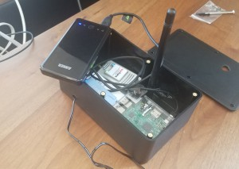

### RESEARCH

  <b>You Are Here</b>   

“You Are Here” is an experiment in using digital technologies to represent and engage truly local communities, by offering content and interaction that is only available in a particular place. Using small, inexpensive, open-source wireless routers to deliver compelling, location-specific content, “You Are Here” seeks to facilitate conversations that are informed by the character of the physical spaces where they are installed, and which, in turn, shape the lives of the people who live, work, and play there. 

