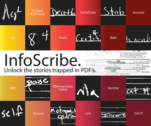
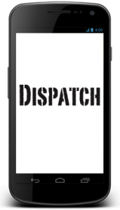
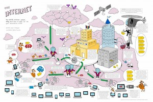
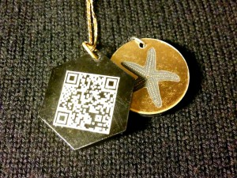

#### RESEARCH
-----

  <b>You Are Here</b>   

“You Are Here” is an experiment in using digital technologies to represent and engage truly local communities, by offering content and interaction that is only available in a particular place. Using small, inexpensive, open-source wireless routers to deliver compelling, location-specific content, “You Are Here” seeks to facilitate conversations that are informed by the character of the physical spaces where they are installed, and which, in turn, shape the lives of the people who live, work, and play there.

READ MORE >>

  <b>InfoScribe</b>   

InfoScribe helps investigative journalists unlock the stories trapped in PDFs. Specifically, InfoScribe is a generalized, web-based crowd-sourcing document transcription platform that invites the public to participate in the journalistic process by transcribing specified data fields from documents. What does that mean in plain English? We are building a platform where journalists can upload image-based documents (such as PDFs) and a community transcribes those documents.

READ MORE >>

  <b>Data Docs</b>   

Data Docs is a series of embeddable interactive video narratives, designed to render seamlessly on desktop and mobile devices. By extending the popular Popcorn.js library via our salt plugin, Data Docs offers a mechanism for integrating both static and interactive JavaScript elements – from text to data-driven charts and graphs – into the timeline of a web-based video. Additional plugins and source files support custom video controls, full-screen support, and device detection. All of these features rely on standards-compliant, open technologies, such as HTML, CSS3, Javascript and jQuery, and will be shared using common resources like GitHub. Project website. GitHub repo. Data Docs platform development is made possible with the generous support of the Knight Foundation Prototype Fund.

READ MORE >>

  <b>Data Docs</b>   

Dispatch is a mobile application that provides secure, authenticated, anonymous communication and publishing. Supported by a grant from the Brown Institute for Media Innovation, our research team developed a fully-functioning app that went through its first field test during the 2012 presidential election, allowing users to post photos and text to our test Tumblr account in real time.

 
READ MORE >>

 

####PROJECTS
-----

  <b>Understanding Your Internet</b>   

One of the major challenges in digital communications security is that every digital message we send interacts with many different systems behind the scenes, each of which can expose bits of information to others. This detailed illustration provides an overview of how the Internet functions, including explanations of what “metadata” is typically stored by digital companies and available to (U.S.) authorities, as well as the mechanics of digital security technologies like Tor and encrypted email.

 
READ MORE >>

  <b>Hiding In Plain Sight</b>   

While it is natural to think of digital information security as primarily an issue of passwords and encryption, a simple first step towards protecting digital data is to make it less detectable. Drawing on the idea of defensive clothing and expanding the concept to include personal data, “Hiding in Plain Sight” incorporates USB keys into convincingly wearable accessories, in an attempt to bring both imagination and whimsy to the often ominous and defeating field of information security. This piece is designed especially to encourage those who don’t consider themselves technically savvy to consider how their individual skills and perspectives can be applied to generate novel forms of digital information protection. “Hiding in Plain Sight” was exhibited as part of the PRISM Breakup exhibit at Eyebeam Gallery in New York, October 4-12, 2013.

 
READ MORE >>

  <b>Jewel.ID</b>   

Jewel.ID is designed to help improve the process of digital authentication by making it easy and appealing for individuals to carry and share their PGP “fingerprint” with others. Using a laser cutter, on one side the Jewel.ID is etched with a decorative pattern or design of the bearer’s choosing; on the other, a QR code representation of the individual’s PGP “fingerprint” is inscribed. To share the code, the other party can simple scan the QR code with their mobile device, or snap a photo of the fingerprint string. This can then be easily compared to the fingerprint found on a key server or other website in order to authenticate it to that particular person. Jewel.ID is sturdy, inexpensive, and easy to add to a keyring or wear as a necklace pendant. By moving the process of digital authentication to an attractive analog “channel,”
Jewel.ID can help improve your daily information security and help you look good doing it!

 
READ MORE >>

